# 🏨 Room Reservation Project

This project is a web-based Room Reservation System developed by 3rd-year students at Mae Fah Luang University (MFU) in 2023.

It supports 3 types of users:
- **Staff**
- **Teacher (Lecturer/Approver)**
- **Student**

---

## 👥 Project Members

- [Mr. Phyo Thura](https://github.com/phyoethura) — 6431501173 (MFU-ID)
- Mr. Salai David Poi Hlan — 6431501174 (MFU-ID)
- Mr. Watcharapol Suphasri — 6431501105 (MFU-ID)
- Miss Panchaya Rueangsri — 6431501140 (MFU-ID)
- Mr. Natchapat Netdee — 6431501130 (MFU-ID)
- Mr. Sappawat Songbanchong — 6431501120 (MFU-ID)
- [Miss Paing Phyo Su](https://github.com/paiphyohsu) — 6431501172 (MFU-ID)

---

## 👨‍💼 Features by User Role

### 🧑‍💼 Staff
- Login
- Browse room list
- Add, edit, disable rooms
- Dashboard
- View reservation history
- Logout

### 👩‍🏫 Teacher (Lecturer/Approver)
- Login
- Browse room list
- View booking requests
- Approve/Reject room requests
- Dashboard
- View reservation history
- Logout

### 👨‍🎓 Student
- Login
- Browse room list
- Book rooms
- Check booking status
- Logout

---

## ⚙️ Setup Instructions

### Prerequisites
- [Node.js](https://nodejs.org/) installed
- [XAMPP](https://www.apachefriends.org/) installed

### Steps
1. Clone or download this repository into your working directory.
2. Run the following commands:
   ```bash
   npm install
   npm init -y
   ```
3. Start XAMPP (Apache & MySQL).
4. Import `test.sql` into your MySQL database using phpMyAdmin.
5. Run the project:
   ```bash
   node proj
   ```

> 📌 **Note:** Passwords in the database are **bcrypt-hashed**. Use the following credentials to log in:

| Role     | MFU-ID      | Password | Description   |
|----------|-------------|----------|----------------|
| Staff    | 6431501173  | 1111     | Role 1         |
| Lecturer | 6431501140  | 2222     | Role 2         |
| Student  | 6431501174  | 3333     | Role 3         |

---

## 🎨 Design Prototype

View the full UI/UX design in Figma:  
🔗 [Figma Design – Web Project](https://www.figma.com/design/a53WWrsvlVSjISxE2lszQS/Web-Project?node-id=0-1&t=0BhN2sxA3Ta3nGLT-1)

---

## 🖼️ Project Screenshots

### 🔐 Authentication

**Homepage**  


**Register Page**  
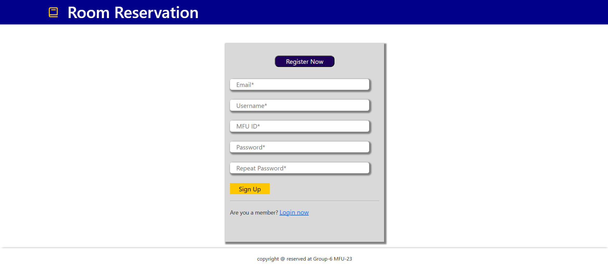

**Login Page**  
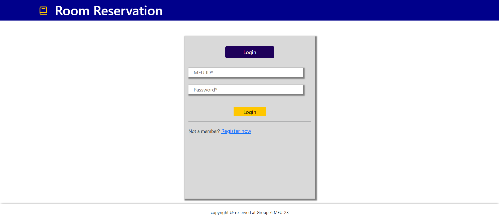

---

### 👨‍🎓 Student UI

**Home Page**  
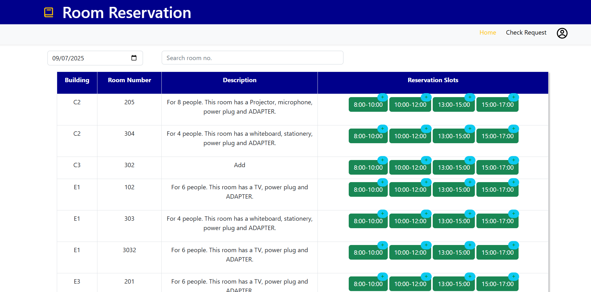

**Booking Popup**  
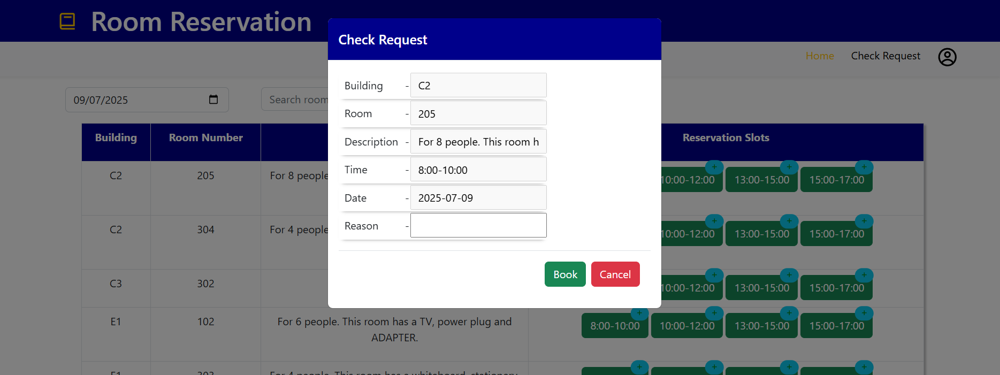

**Booking Success**  
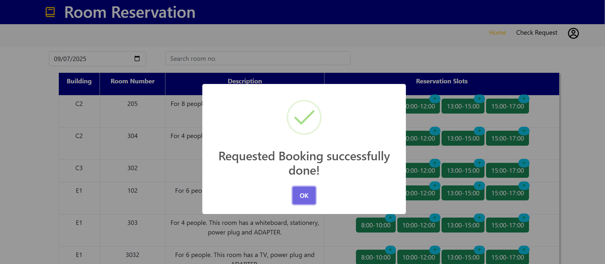

**Check Booking Request**  
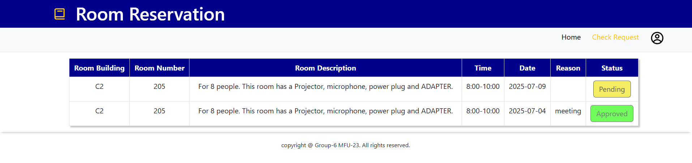

**Profile**  
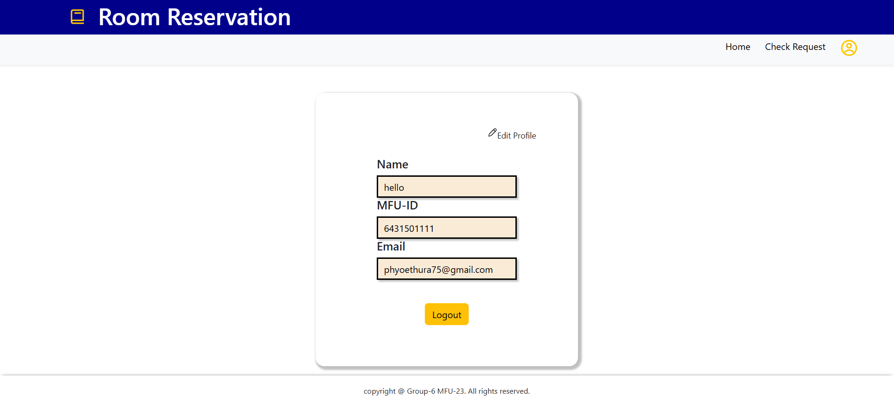

---

### 👩‍💼 Staff UI

**Homepage**  
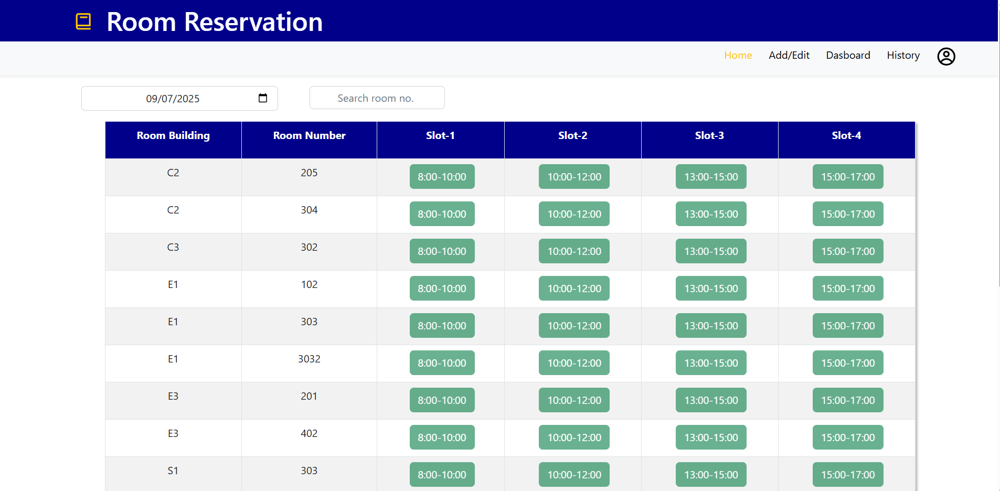

**Manage Rooms (Add/Edit/Delete)**  
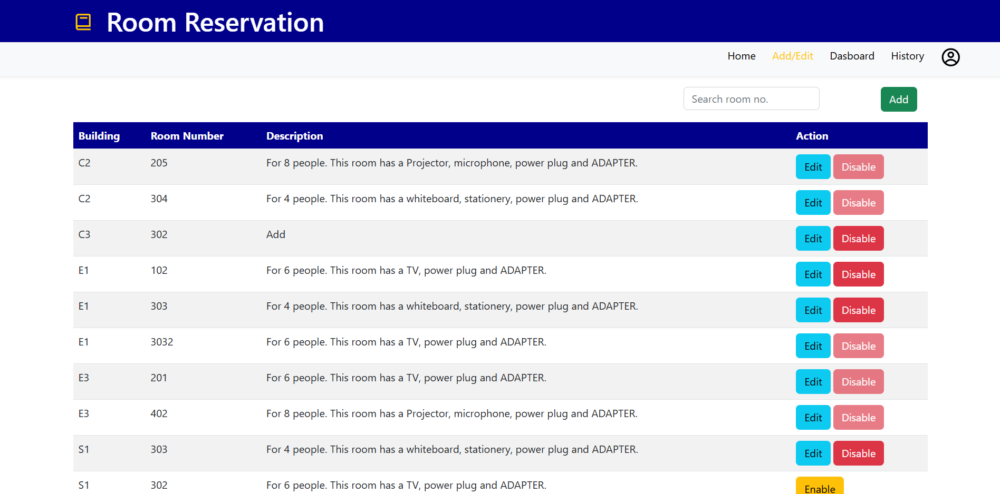

**Add Room Popup**  


**Dashboard**  
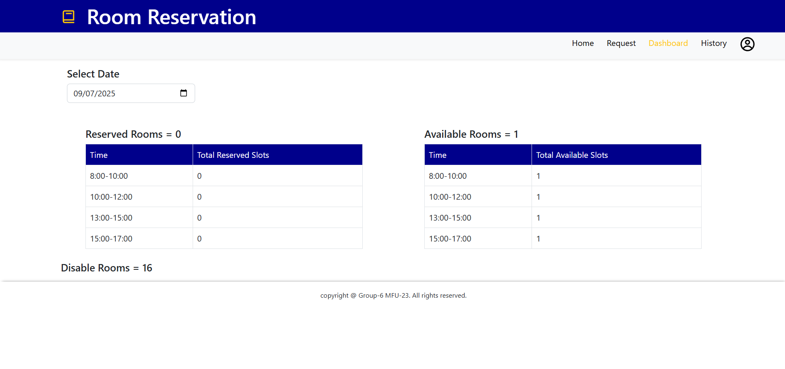

**History**  
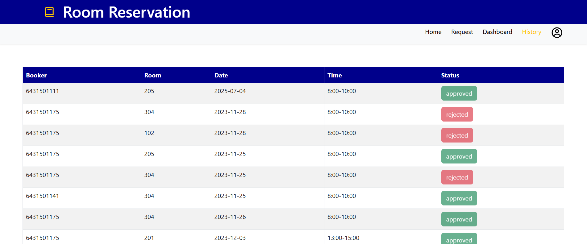

**Profile**  
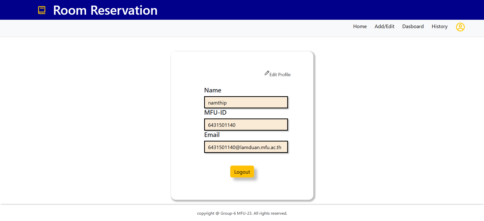

---

### 👩‍🏫 Lecturer UI

**Homepage**  
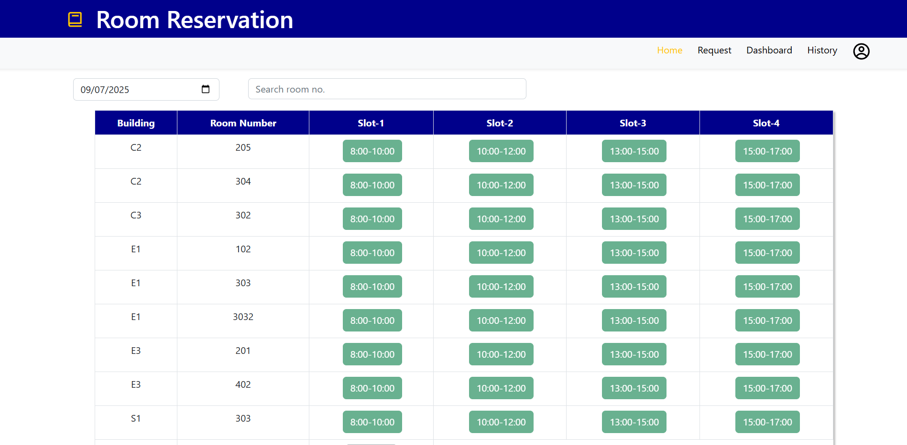

**Request Page**  
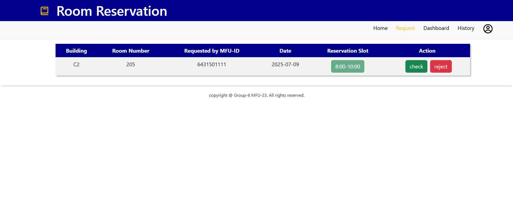

**Request Check Popup**  
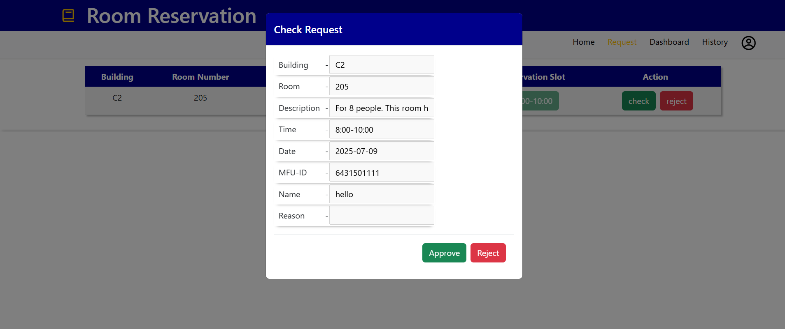

**Dashboard**  


**History**  


**Profile**  
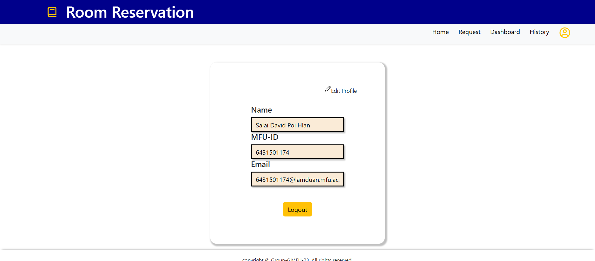
